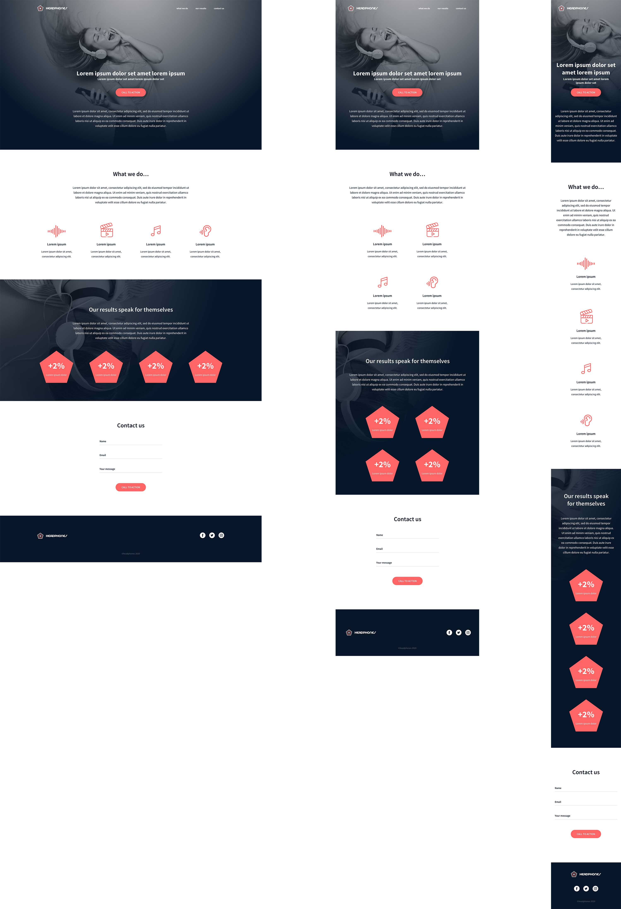

# 0x09. Implement a design from scratch
___
For this project we had to implement from scratch everything learned in previous projects, HTML / CSS / Accessibility / Responsive design.

Without specific instructions and with the freedom to do it the way we want, with only one goal: Have a fully functional web page that looks the same as the designer file.

This webpage has been designed by Nicolas Philippot, UI/UX designer.

Here the final result:

### Requirements
- you are not allowed to import external CSS framework (like Bootstrap)
- you are not to use Javascript

###  Mandatory Tasks
###### 0. Read and be familiar with Figma

Create an account in Figma and open this project and “Duplicate to your Drafts” to have access to all design details.

###### 1. Header

Building a web page the right way, is not easy - expect if you put in place strong foundations:
- reset CSS styling
- use variables
- simple/“as generic as you can” CSS selectors
- avoid as more as you can super specific CSS selector
- simple HTML structure - div containers are your friend!

###### 2. "What we do..." section

For this second task: create the “What we do…” section
In this section, you will need custom font icons. Here the archive of it: holberton_school-icon.zip Inside you will find demo page of how to use it.

###### 3. "Our results" section 

For this third task: create the “Our results” section
Now you can reuse components form the previous task!

###### 4. Contact us

A good landing page has always a contact form.
You are free to add any animations and/or constraints on fields.

###### 5. Footer

Last piece of the page… the Footer!

## Author
___
##### Andrea Mendez Mesias

Graphic Designer and Holberton Specialization Student

GitHub - andreammgcol
